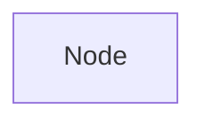

# Abstact Syntax Tree

**_Abstact Syntax Tree_** (AST) is a structure used in programming to represent the abstact syntatic structure of text.

The correct sentence structure and spelling of the words are represented without details, which means abstarct, in a form of tree structure, from the beginning of program execution on top of that structure to the end of it, in the bottom.

AST has components by itself, this components called "nodes"

Nodes are represented in a square shape form.

AST outupt is served to create a logically sound structure of the program and move it further into execution steps of Python engine