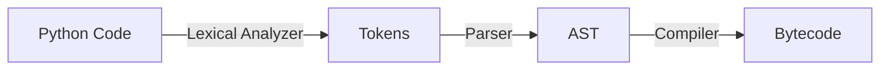

# Compiler

**_The Compiler_**: is a component of Python engine.

Compiler performs a task of taking as an input AST logical structure and wrote from it a lower-level programming language called _bytecode_.

Bytecode is optimized by Python engine to execute more quickly than raw source code.

So, compiler takes as an input AST logical structure and creates as an outup a lower-level programming language called bytecode.

Ultimatly, the compiler is served for source code optimization after the preceeding steps of lexical analysis, parsing, and compilation were perfrormed.