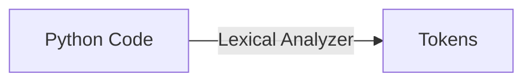

# Lexical Analyzer

**_Lexical Analyzer_** is a component of Python engine.

The Lexical Analyzer perform a task of scanning a file and break it down into tiny meaningfull pieces of building blocks of Python program called "tokens".

So, the first step performed by lexical analyzer is to break down source code, into tiny meaningfull pieces of building blocks of Python program.

This tiny meaningfull pieces of building blocks of Python program are called "tokens".

Here is a diagram that shows the steps, in which a python lexical analyzer is involved:

So, Lexical Analyzer interacting with Python files as an input, and creating the output, represented by tokens.

Ultimately, Lexical Analyzer performs a task of receiving an input in form of Python files and convert it to a stream of tokens.