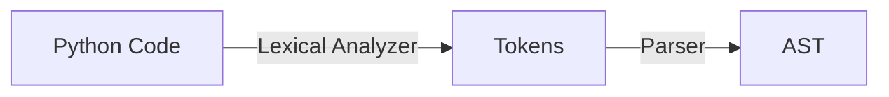

# Parser

**_Parser_** is a component of Python engine.

Parser performs a task of taking as an input tokens, provided by lexical analyzer, and check syntactically if they relevant to the Python structural and spelling rules.

After taking as an input tokens from lexical analyzer, parser provides an output in form of logicall structure, represented in a hierarchical map called an Abstract Syntax Tree, an AST for short.

So, Parser interacting with tokens as an input, provides an output in the logical form called an Abstract Syntax Tree, for short AST.

