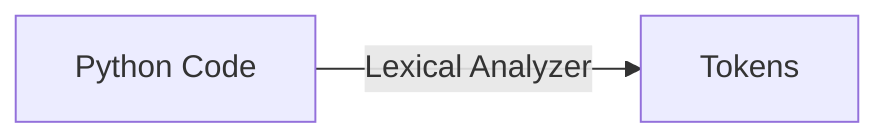
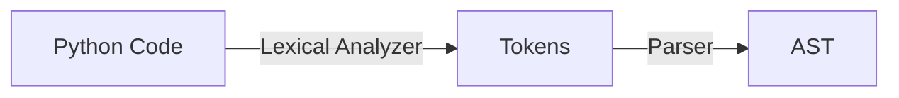
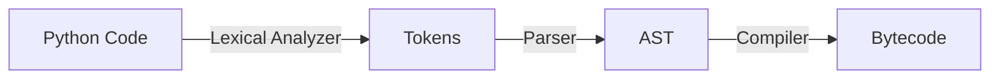
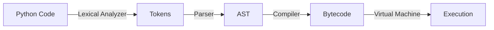

# Python Engine

We talked about syntax and semantics of the language.

In the context of a programming language, if it would have only definitions and rules for it written in documents, programming language would not be able to perform any kind of operations.

To perform any operations, it needs an engine. The actual program that would execute syntactically sound and semantically meaningfull code into the program.

So, let's talk about the engine, the component of python that actually makes Python programming language "alive".

Core components of Python engine: The Lexical Analyzer; The Parser; The Compiler; The Virual Machine.

Each of thoose components performs a specific task to execute a code.

**_Lexical Analyzer_** is a component of Python engine.

The Lexical Analyzer performs a task of scanning a file and break it down into tiny meaningfull pieces of building blocks of Python program called "tokens".

So, the first step performed by lexical analyzer is to break down source code, into tiny meaningfull pieces of building blocks of Python program.

This tiny meaningfull pieces of building blocks of Python program are called "tokens".

Here is a diagram that shows the steps, in which a python lexical analyzer is involved:

So, Lexical Analyzer interacting with Python files as an input, and creating the output, represented by tokens.

Ultimately, Lexical Analyzer performs a task of receiving an input in form of Python files and convert it to a stream of tokens.

So, Parser interacting with tokens as an input, provides an output in the logical form called an Abstract Syntax Tree, for short AST.

**_The Compiler_**: is a component of Python engine.

Compiler performs a task of taking as an input AST logical structure and wrote from it a lower-level programming language called _bytecode_.

Bytecode is optimized by Python engine to execute more quickly than raw source code.

So, compiler takes as an input AST logical structure and creates as an outup a lower-level programming language called bytecode.

Ultimatly, the compiler is served for source code optimization after the preceeding steps of lexical analysis, parsing, and compilation were perfrormed.

**_Virtual Machine_**: is a component of Python engine.

Virtual Machine performs a task of taking as an input optimized Python code, which is _bytecode_ and run it step-by-step, line-by-line.

So, the last step of Python engine is execution of a program performed by Python Virtual Machine.

Ultimately, remember that Python Virtual Machine is running the last step in the sequantial process of Python Engine and executes the programm.

So, Python Engine steps of executiong a Python program are: lexical analysis performed by Lexical Analyzer, parsing performed by Parser, compilation performed by Compiler, and optimized code execution performed by Virtual Machine.

Ultimately, remember ther is four core Python execution steps performed by Python Engine to run a programm. Which are: Lexical Analysis, Parsing, Compilation, and Execution.