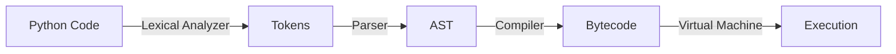

# Virtual Machine

**_Virtual Machine_**: is a component of Python engine.

Virtual Machine performs a task of taking as an input optimized Python code, which is _bytecode_ and run it step-by-step, line-by-line.

So, the last step of Python engine is execution of a program performed by Python Virtual Machine.

Ultimately, remember that Python Virtual Machine is running the last step in the sequantial process of Python Engine and executes the programm.